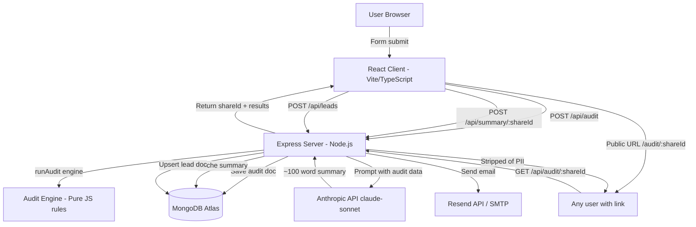

# Architecture

## System Diagram

## Data Flow

1. **User fills form** → React state (persisted to localStorage across reloads)
2. **Submit** → `POST /api/audit` with tools array, teamSize, primaryUseCase
3. **Audit engine** → pure rule-based JS evaluates each tool: plan fit, seat efficiency, cross-tool alternatives. Returns per-tool recommendations + savings figures.
4. **MongoDB** → audit document saved with `shareId` (nanoid 10-char), results embedded. PII fields (email) stored separately.
5. **Response** → shareId + results returned. Client navigates to `/audit/:shareId`.
6. **AI Summary** → separate POST to `/api/summary/:shareId`. Server builds a structured prompt from audit data, calls Claude API, caches result. Falls back to templated string on API failure.
7. **Lead capture** → `POST /api/leads`. Honeypot check → email validation → upsert into leads collection → transactional email via Resend → flag audit doc as captured.
8. **Share URL** → `/audit/:shareId` is fully public. `GET /api/audit/:shareId` returns the document with email/companyName/role fields excluded via Mongoose `.select()`.

## Stack Choice

| Layer | Choice | Why |
|-------|--------|-----|
| Frontend | React + TypeScript + Vite | Fastest iteration, great DX, Vite HMR. TypeScript catches pricing arithmetic bugs. |
| Styling | Tailwind CSS | Utility-first keeps component files self-contained. No CSS-in-JS runtime overhead. |
| Animation | Framer Motion | Clean declarative animations for the results page reveal. |
| Backend | Express.js | Minimal boilerplate for a CRUD-heavy API. No GraphQL complexity needed at this scope. |
| Database | MongoDB + Mongoose | Variable-length tool arrays fit document model naturally. No schema migrations as tool list grows. |
| Email | Resend (SMTP fallback) | Resend free tier: 100 emails/day. Nodemailer SMTP as fallback for dev. |
| AI | Anthropic claude-sonnet | The audit tool itself audits Claude spend — using it here is on-brand and the API is reliable. |
| Auth | None | No login required by design. shareId provides pseudonymous access control. |
| Hosting | Vercel (client) + Render (server) | Both free tiers work for MVP. MongoDB Atlas M0 free cluster for DB. |

## Scaling to 10k audits/day

1. **MongoDB Atlas** — Move from M0 to M10 ($57/mo). Add compound index on `(shareId, createdAt)`. 10k docs/day is trivial for Mongo.
2. **Express server** — Add horizontal scaling on Render (paid tier) or migrate to Fly.io with autoscaling. Add Redis for rate-limit state sharing across instances.
3. **AI summaries** — Queue with BullMQ + Redis. Generate asynchronously, poll from client. Prevents Anthropic API latency blocking the results page.
4. **Email** — Resend scales fine to 10k/day on their $20/mo plan.
5. **CDN** — Client build served from Vercel edge — no changes needed.
6. **Audit engine** — Pure CPU-bound JS, no I/O. Scales linearly with workers.
